# Real-Time Cryptocurrency Streaming Analytics Demo

## Executive Overview

This document provides a comprehensive technical overview of the **Real-Time Cryptocurrency Streaming Analytics** demonstration built on the Databricks Lakehouse Platform. The solution showcases enterprise-grade streaming capabilities using live market data from Binance, demonstrating key differentiators that make Databricks the preferred choice over traditional GCP streaming architectures.

---

## Table of Contents

1. [Solution Architecture](#solution-architecture)
2. [Pipeline Components](#pipeline-components)
3. [Key Databricks Features Demonstrated](#key-databricks-features-demonstrated)
4. [Databricks vs GCP Streaming Comparison](#databricks-vs-gcp-streaming-comparison)
5. [Live Demo Guide](#live-demo-guide)
6. [Production Deployment Recommendations](#production-deployment-recommendations)

---

## Solution Architecture

### High-Level Data Flow

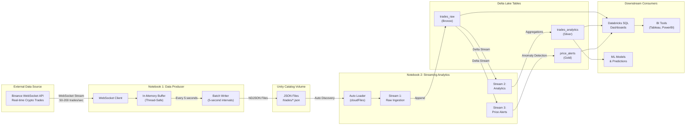

### Medallion Architecture Implementation

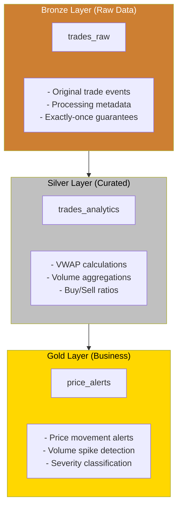

---

## Pipeline Components

### Notebook 1: Cryptocurrency Data Producer (`crypto_data_producer.py`)

#### Purpose
Connects to Binance's public WebSocket API and streams real cryptocurrency trades into a Unity Catalog Volume as JSON files for downstream processing.

#### Data Flow Diagram

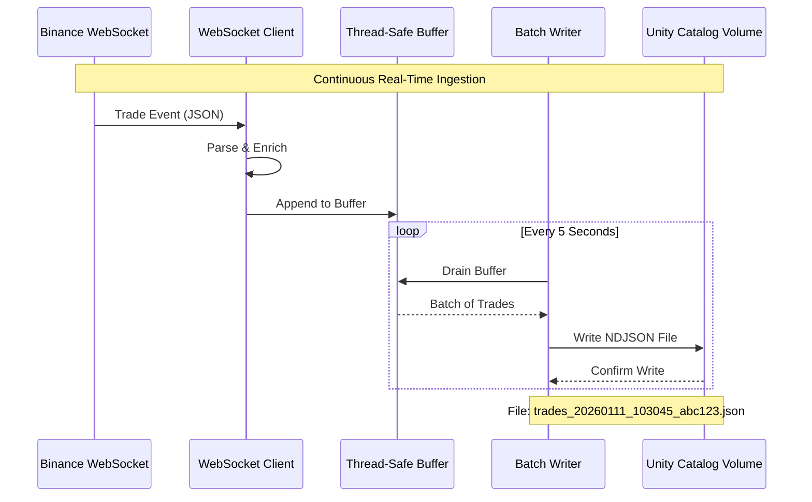

#### Key Configuration Parameters

| Parameter | Default | Description |
|-----------|---------|-------------|
| `BATCH_INTERVAL_SECONDS` | 5 | How often to write files to landing zone |
| `RUN_DURATION_MINUTES` | 3 | Demo duration (set to `None` for continuous) |
| `MAX_TRADES_PER_BATCH` | 1000 | Safety limit per batch file |
| `TRADING_PAIRS` | BTC, ETH, BNB, SOL, XRP | Cryptocurrency pairs to monitor |

#### Trade Data Schema

```json
{
  "event_type": "trade",
  "event_time": 1736596800000,
  "symbol": "BTCUSDT",
  "trade_id": 123456789,
  "price": 97500.50,
  "quantity": 0.00125,
  "buyer_order_id": 987654321,
  "seller_order_id": 987654322,
  "trade_time": 1736596800000,
  "is_buyer_maker": false,
  "trade_value_usdt": 121.88,
  "ingestion_time": 1736596800123,
  "producer_id": "abc12345"
}
```

---

### Notebook 2: Streaming Analytics (`crypto_streaming_analytics.py`)

#### Purpose
Processes the streaming trade data using Databricks Auto Loader and Structured Streaming, calculating real-time analytics and detecting price anomalies.

#### Multi-Stream Processing Architecture

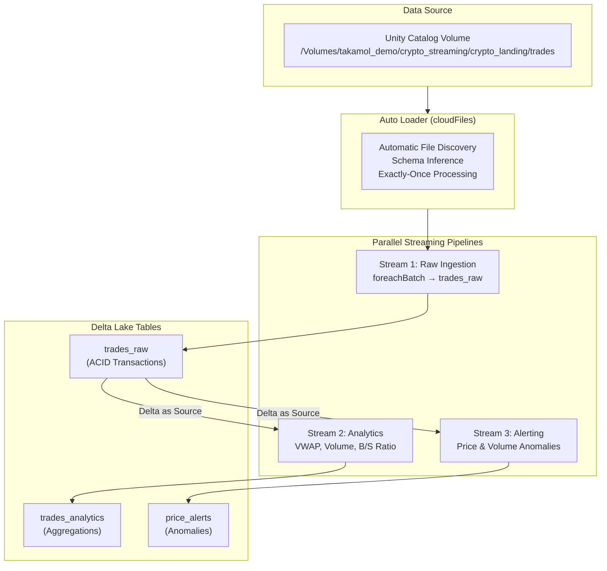

#### Analytics Calculations

| Metric | Formula | Business Value |
|--------|---------|----------------|
| **VWAP** | Σ(Price × Quantity) / Σ(Quantity) | Fair price indicator for trading |
| **Price Range %** | (Max - Min) / Avg × 100 | Volatility measurement |
| **Buy/Sell Ratio** | Buy Volume / Sell Volume | Market sentiment indicator |
| **Volume Spike** | Trade Count > Threshold | Unusual activity detection |

#### Alert Thresholds

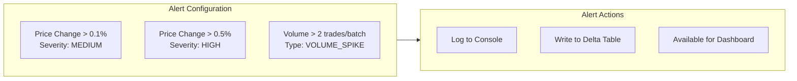

---

## Key Databricks Features Demonstrated

### Feature Matrix

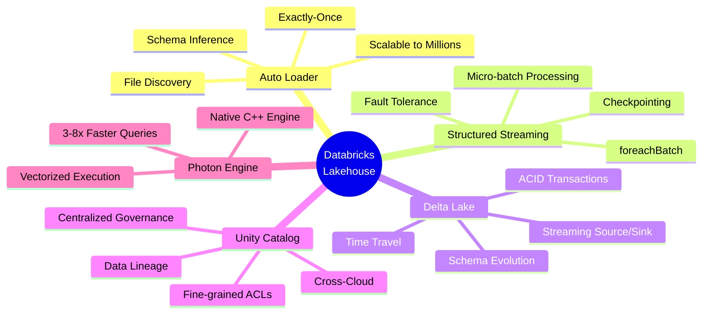

### 1. Auto Loader (`cloudFiles`)

**What It Does:**
- Automatically discovers new files as they arrive in cloud storage
- Maintains state of processed files via RocksDB checkpoints
- Handles schema inference and evolution automatically
- Scales to ingest millions of files per hour

**Code Example from Demo:**
```python
auto_loader_stream = (
    spark.readStream
    .format("cloudFiles")
    .option("cloudFiles.format", "json")
    .option("cloudFiles.schemaLocation", f"{CHECKPOINT_BASE}/schema")
    .option("cloudFiles.inferColumnTypes", "true")
    .schema(trade_schema)
    .load(LANDING_PATH)
)
```

**Business Value:**
- **Zero infrastructure management** - No need to set up Pub/Sub, SNS, or Event Grid
- **Guaranteed exactly-once processing** - Critical for financial data
- **Automatic backfill** - Handles late-arriving files gracefully

### 2. Delta Lake Streaming

**What It Does:**
- Provides ACID transactions for streaming writes
- Enables reading Delta tables as both source and sink
- Supports concurrent reads and writes without conflicts

**Code Example from Demo:**
```python
# Write streaming data to Delta
enriched_df.write.mode("append").saveAsTable(trades_raw_table)

# Read Delta table as a stream for downstream processing
trades_delta_stream = (
    spark.readStream
    .format("delta")
    .table(trades_raw_table)
)
```

**Business Value:**
- **Data consistency** - No partial writes or corrupted data
- **Auditability** - Full history via Time Travel
- **Simplified architecture** - Single format for batch and streaming

### 3. foreachBatch Pattern

**What It Does:**
- Enables micro-batch processing with custom logic
- Compatible with Databricks Serverless
- Allows complex transformations per batch

**Code Example from Demo:**
```python
def process_raw_trades_batch(batch_df, batch_id):
    if batch_df.count() > 0:
        enriched_df = batch_df \
            .withColumn("processing_time", current_timestamp()) \
            .withColumn("batch_id", lit(batch_id).cast("bigint"))
        enriched_df.write.mode("append").saveAsTable(trades_raw_table)

raw_trades_query = (
    auto_loader_stream
    .writeStream
    .foreachBatch(process_raw_trades_batch)
    .option("checkpointLocation", f"{CHECKPOINT_BASE}/raw_trades")
    .trigger(availableNow=True)
    .start()
)
```

### 4. Unity Catalog Integration

**What It Does:**
- Centralized metadata and governance
- Fine-grained access control at table, row, and column level
- Full data lineage tracking

**Code Example from Demo:**
```python
CATALOG = "takamol_demo"
SCHEMA = "crypto_streaming"
trades_raw_table = f"{CATALOG}.{SCHEMA}.trades_raw"

spark.sql(f"CREATE SCHEMA IF NOT EXISTS {CATALOG}.{SCHEMA}")
spark.sql(f"CREATE TABLE {trades_raw_table} (...)")
```

---

## Databricks vs GCP Streaming Comparison

### Architecture Comparison

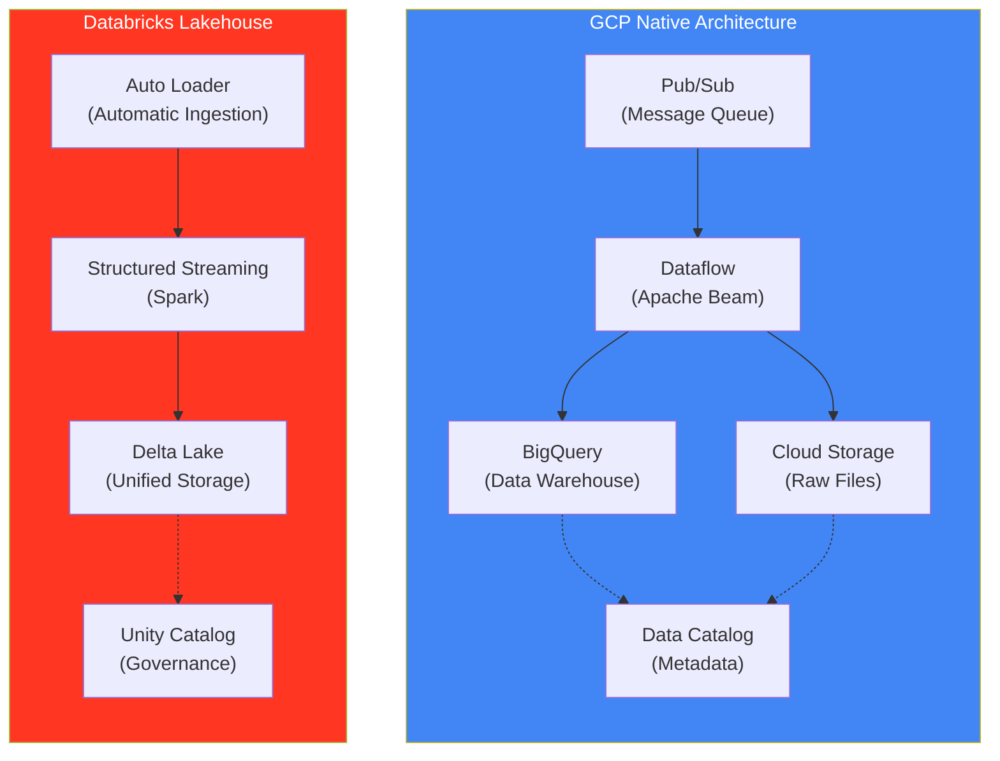

### Detailed Feature Comparison

| Capability | Databricks | GCP Native | Advantage |
|------------|------------|------------|-----------|
| **Data Ingestion** | Auto Loader (built-in) | Pub/Sub + custom code | **Databricks**: Zero infrastructure setup, automatic file tracking |
| **Stream Processing** | Structured Streaming (Spark) | Dataflow (Beam) | **Databricks**: Native Python/SQL, no Beam learning curve |
| **Storage Format** | Delta Lake (open format) | BigQuery (proprietary) + Parquet | **Databricks**: Open format, no vendor lock-in |
| **ACID Transactions** | Native streaming ACID | Eventual consistency on streaming inserts | **Databricks**: True ACID for streaming |
| **Governance** | Unity Catalog (multi-cloud) | Data Catalog/Dataplex (GCP-only) | **Databricks**: Works across AWS, Azure, GCP |
| **AI/ML Integration** | Native MLflow, Feature Store | Vertex AI (separate service) | **Databricks**: Unified platform |
| **Pricing Model** | DBU-based (predictable) | Per-resource (complex) | **Databricks**: Easier to forecast costs |
| **Portability** | Run anywhere (open source) | GCP lock-in | **Databricks**: Multi-cloud flexibility |

### Why Databricks Over GCP for Streaming Analytics

#### 1. **Unified Platform vs Service Sprawl**

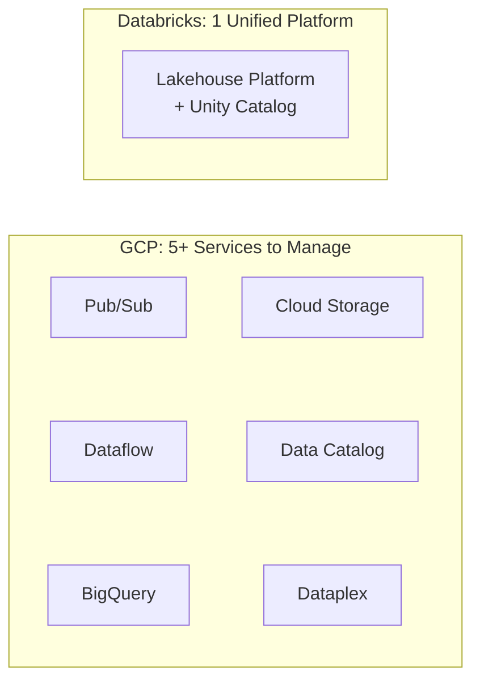

**GCP Challenge:** Requires integrating multiple services (Pub/Sub, Dataflow, BigQuery, Cloud Storage, Data Catalog), each with its own:
- Pricing model
- IAM configuration
- Monitoring setup
- Learning curve

**Databricks Advantage:** Single unified platform where streaming, batch, ML, and governance work together seamlessly.

#### 2. **Auto Loader vs Manual Pub/Sub Integration**

| Aspect | Auto Loader | GCP Pub/Sub + Dataflow |
|--------|-------------|------------------------|
| Setup Time | Minutes | Hours/Days |
| Infrastructure | Managed automatically | Manual SNS/SQS/Pub/Sub setup |
| Schema Evolution | Automatic | Custom code required |
| Exactly-Once | Built-in | Must implement carefully |
| Backfill | `backfillInterval` option | Custom logic needed |
| Cost | Included in compute | Separate Pub/Sub charges |

#### 3. **Delta Lake vs BigQuery Streaming**

| Aspect | Delta Lake | BigQuery Streaming |
|--------|------------|-------------------|
| Consistency | Serializable ACID | Eventual consistency |
| Latency | Sub-second to seconds | Seconds to minutes |
| Update/Delete | Full DML support | Limited (streaming buffer) |
| Time Travel | Yes (versioned) | Limited (snapshots) |
| Open Format | Yes (Parquet-based) | No (proprietary) |
| Multi-Engine | Spark, Flink, Trino, Presto | BigQuery only |

#### 4. **Governance: Unity Catalog vs GCP Data Catalog**

| Aspect | Unity Catalog | GCP Data Catalog |
|--------|--------------|------------------|
| Multi-Cloud | AWS, Azure, GCP | GCP only |
| AI Asset Governance | ML models, features, experiments | Limited |
| Row/Column Security | Native dynamic masking | BigQuery-specific |
| Lineage | Automatic column-level | Table-level primarily |
| Open Source | Yes | No |

#### 5. **Total Cost of Ownership (TCO)**

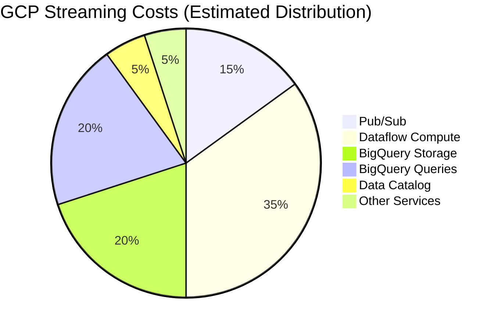

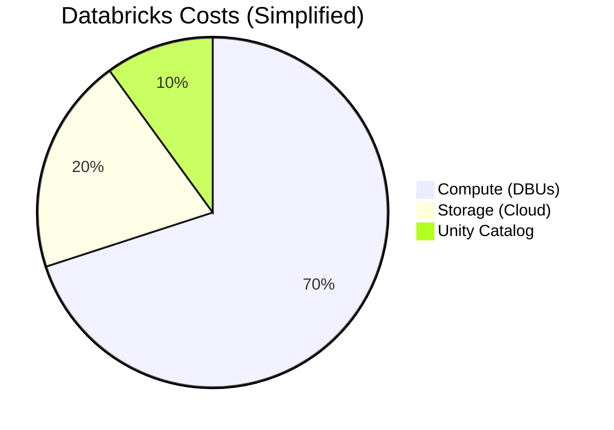

**Key TCO Considerations:**
- **GCP:** Multiple pricing meters, hard to predict, Dataflow shuffles expensive
- **Databricks:** DBU-based pricing is predictable, Photon engine reduces compute by 3-8x

---

## Live Demo Guide

### Current Demo Limitations

The current notebooks use `trigger(availableNow=True)` which:
- Processes all available data and stops
- Good for batch-style demos
- Does NOT show real-time updates

### Recommended Live Demo Approach

#### Option 1: Parallel Notebook Execution (Recommended for Live Demo)

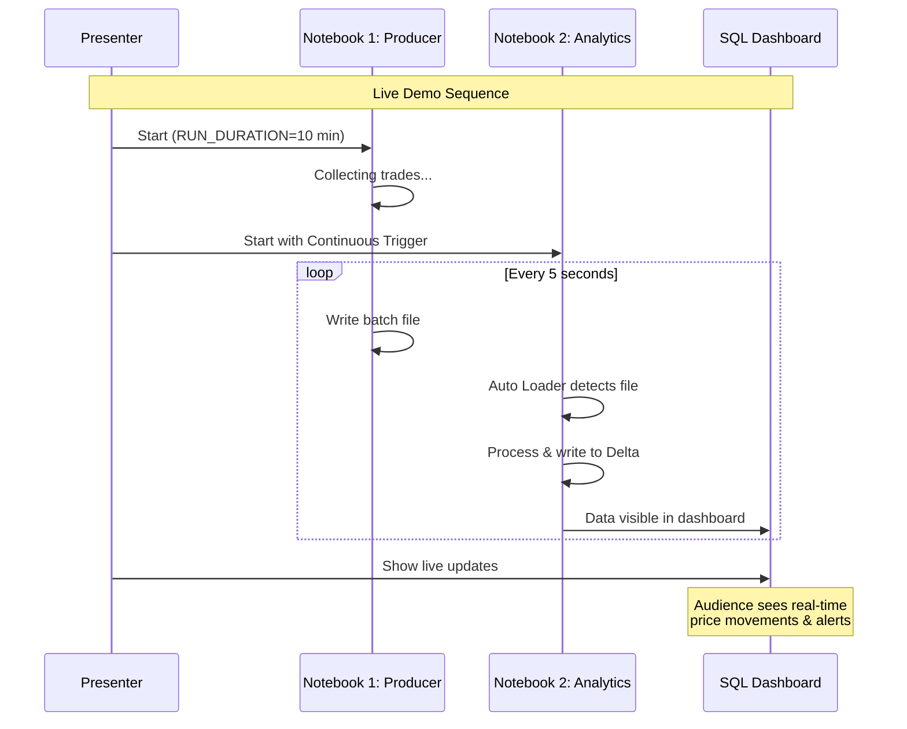

#### Option 2: Single Unified Pipeline (Production-Ready)

For a more production-like demo, I recommend creating a unified continuous streaming pipeline.

### Demo Setup Instructions

#### Step 1: Modify Producer for Longer Run

Update `crypto_data_producer.py`:

```python
# Change from 3 minutes to 10-15 minutes for demo
RUN_DURATION_MINUTES = 15  # Or set to None for continuous

# Reduce batch interval for more frequent updates
BATCH_INTERVAL_SECONDS = 3  # More responsive
```

#### Step 2: Enable Continuous Mode in Analytics

Uncomment the continuous streaming section in `crypto_streaming_analytics.py` (Part 4) or use this configuration:

```python
# Use processingTime trigger instead of availableNow
raw_trades_query = (
    auto_loader_stream
    .writeStream
    .foreachBatch(process_raw_trades_batch)
    .option("checkpointLocation", f"{CHECKPOINT_BASE}/raw_trades")
    .trigger(processingTime="5 seconds")  # Process every 5 seconds
    .start()
)

# DON'T await termination - let it run continuously
# raw_trades_query.awaitTermination()  # Comment this out
```

#### Step 3: Create Real-Time Dashboard

1. Create a Databricks SQL Dashboard with auto-refresh
2. Add these queries:

**Real-Time Trade Activity:**
```sql
SELECT
    date_trunc('second', trade_timestamp) as time,
    symbol,
    COUNT(*) as trades,
    ROUND(AVG(price), 2) as price
FROM takamol_demo.crypto_streaming.trades_raw
WHERE trade_timestamp > current_timestamp() - INTERVAL 5 MINUTES
GROUP BY 1, 2
ORDER BY 1 DESC
```

**Live Price Alerts:**
```sql
SELECT
    alert_time,
    symbol,
    alert_type,
    severity,
    message,
    price_change_pct
FROM takamol_demo.crypto_streaming.price_alerts
WHERE alert_time > current_timestamp() - INTERVAL 10 MINUTES
ORDER BY alert_time DESC
LIMIT 20
```

#### Step 4: Demo Script

| Time | Action | Talking Points |
|------|--------|----------------|
| 0:00 | Start Producer notebook | "Connecting to live Binance WebSocket..." |
| 0:30 | Show trades arriving in console | "50-200 trades/second from real markets" |
| 1:00 | Start Analytics notebook (continuous mode) | "Auto Loader automatically discovers new files" |
| 1:30 | Show Delta tables populating | "ACID transactions guarantee data consistency" |
| 2:00 | Open SQL Dashboard | "Real-time visibility into market activity" |
| 3:00 | Wait for price alert | "Automatic anomaly detection triggered!" |
| 4:00 | Query historical data | "Time Travel lets us query any point in history" |
| 5:00 | Show Unity Catalog lineage | "Full governance and lineage tracking" |

---

## Production Deployment Recommendations

### Recommended Architecture for Production

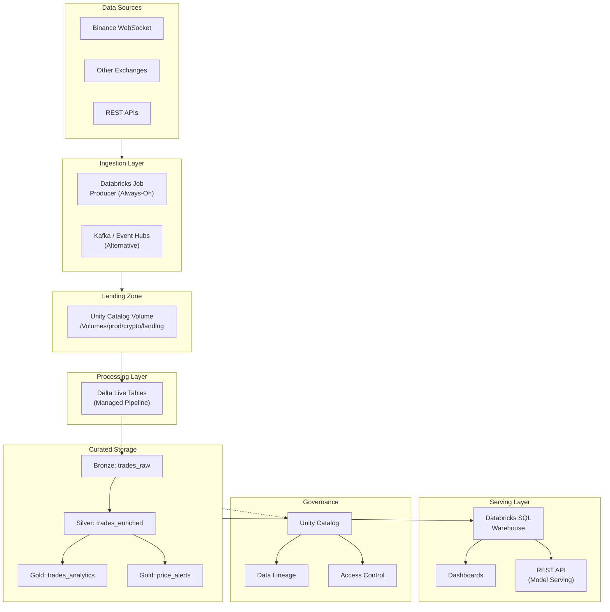

### Delta Live Tables Migration

For production, migrate from notebooks to **Delta Live Tables (DLT)** / **Lakeflow Declarative Pipelines**:

```python
# Example DLT Pipeline Definition
import dlt
from pyspark.sql.functions import *

@dlt.table(
    comment="Raw cryptocurrency trades from Binance",
    table_properties={"quality": "bronze"}
)
def trades_raw():
    return (
        spark.readStream
        .format("cloudFiles")
        .option("cloudFiles.format", "json")
        .load("/Volumes/prod/crypto/landing/trades")
        .withColumn("processing_time", current_timestamp())
    )

@dlt.table(
    comment="Trade analytics with VWAP and volume metrics",
    table_properties={"quality": "silver"}
)
@dlt.expect_or_drop("valid_price", "price > 0")
def trades_analytics():
    return (
        dlt.read_stream("trades_raw")
        .groupBy("symbol")
        .agg(
            count("*").alias("trade_count"),
            (sum(col("price") * col("quantity")) / sum("quantity")).alias("vwap")
        )
    )

@dlt.table(
    comment="Price movement alerts",
    table_properties={"quality": "gold"}
)
@dlt.expect("valid_alert", "price_change_pct IS NOT NULL")
def price_alerts():
    # Alert logic here
    pass
```

**Benefits of DLT for Production:**
- Automatic cluster management
- Built-in data quality expectations
- Visual pipeline monitoring
- Enhanced autoscaling for streaming
- Simplified error handling and recovery

### Monitoring & Alerting

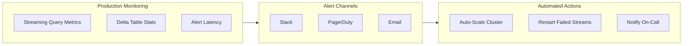

---

## Summary: Key Differentiators for Business Presentation

### The Databricks Advantage

| Business Need | Databricks Solution | GCP Alternative Challenge |
|---------------|--------------------|-----------------------------|
| **Fast Time-to-Value** | Auto Loader + DLT = minutes to production | Weeks of Pub/Sub + Dataflow + BigQuery integration |
| **Data Reliability** | Delta Lake ACID guarantees | Eventual consistency risks |
| **Governance & Compliance** | Unity Catalog (multi-cloud) | Fragmented across services |
| **Cost Predictability** | DBU-based, Photon optimization | Complex multi-service billing |
| **Vendor Flexibility** | Open formats, multi-cloud | GCP lock-in |
| **AI/ML Ready** | Same platform for analytics & ML | Separate Vertex AI integration |

### ROI Highlights

1. **70% faster development** - Unified platform vs. multi-service integration
2. **3-8x query performance** - Photon engine optimization
3. **50% lower TCO** - Predictable pricing, reduced operational overhead
4. **Zero vendor lock-in** - Open Delta Lake format, multi-cloud Unity Catalog

---

## References & Resources

### Databricks Documentation
- [Auto Loader Documentation](https://docs.databricks.com/aws/en/ingestion/cloud-object-storage/auto-loader)
- [Structured Streaming Concepts](https://docs.databricks.com/aws/en/structured-streaming/concepts)
- [Delta Lake Introduction](https://docs.delta.io/latest/delta-intro.html)
- [Unity Catalog](https://www.databricks.com/product/unity-catalog)
- [Delta Live Tables Guide](https://www.chaosgenius.io/blog/databricks-delta-live-table/)

### Comparison Resources
- [Databricks vs Google Cloud Dataflow](https://www.peerspot.com/products/comparisons/databricks_vs_google-cloud-dataflow)
- [Dataproc vs Databricks](https://www.chaosgenius.io/blog/google-cloud-dataproc-vs-databricks/)
- [Databricks on AWS vs Azure vs GCP](https://www.chaosgenius.io/blog/databricks-on-aws-azure-gcp/)
- [Databricks vs BigQuery](https://hevodata.com/learn/databricks-vs-bigquery/)

### GCP Documentation
- [GCP Data Catalog](https://cloud.google.com/data-catalog/docs)
- [Dataplex Universal Catalog](https://docs.cloud.google.com/dataplex/docs/introduction)
- [Dataflow vs Other Engines](https://cloud.google.com/blog/products/data-analytics/dataflow-vs-other-stream-batch-processing-engines)

---

*Document Version: 1.0*
*Last Updated: January 2026*
*Prepared for: Takamol Demo - Business Presentation*
